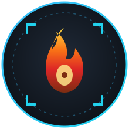
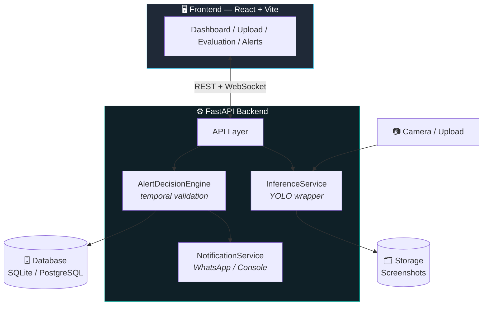

<div align="center">



# 🔥 FireGuard AI
### Real-Time Fire & Smoke Detection System

**Production-grade, YOLO-powered detection engine with a FastAPI backend, a React dashboard, and instant WhatsApp alerts.**

[](LICENSE)
[](backend)
[](backend)
[](frontend)
[](backend)
[](docker-compose.yml)

</div>

---

## 📋 Table of Contents

- [🔥 FireGuard AI](#-fireguard-ai)
    - [Real-Time Fire \& Smoke Detection System](#real-time-fire--smoke-detection-system)
  - [📋 Table of Contents](#-table-of-contents)
  - [✨ Overview](#-overview)
  - [🚀 Key Features](#-key-features)
  - [🏗️ Architecture](#️-architecture)
  - [🧰 Tech Stack](#-tech-stack)
  - [⚡ Quick Start (Local Development)](#-quick-start-local-development)
    - [1️⃣ Backend](#1️⃣-backend)
    - [2️⃣ Frontend](#2️⃣-frontend)
    - [3️⃣ Open the App](#3️⃣-open-the-app)
    - [4️⃣ First-Time Setup](#4️⃣-first-time-setup)
  - [🔧 Configuration](#-configuration)
  - [📁 Project Structure](#-project-structure)
  - [🧪 Testing](#-testing)
  - [🐳 Docker Deployment](#-docker-deployment)
  - [🗺️ Roadmap](#️-roadmap)
  - [🤝 Contributing](#-contributing)
  - [📄 License](#-license)

---

## ✨ Overview

**FireGuard AI** is an end-to-end fire and smoke detection platform built for real-world deployment. It combines a **YOLOv8** computer-vision model with a temporal validation engine to minimize false alarms, and ships with a full-stack dashboard for live monitoring, uploads, evaluation, and alerting — all containerized and ready to deploy.

> 🎯 **Goal:** catch fire and smoke early, confirm it's real before alerting, and notify the right people instantly.

---

## 🚀 Key Features

| Feature | Description |
|---|---|
| 🎥 **Real-Time Detection** | WebSocket-powered live camera feed with YOLO inference |
| ⏱️ **Temporal Validation** | Sliding-window algorithm filters noise and prevents false positives |
| 🚨 **Smart Alerting** | Cooldown-based alert system with WhatsApp notification integration |
| 📤 **Upload Analysis** | Drag-and-drop detection on individual images and videos |
| 📊 **Model Evaluation** | Built-in gallery of training metrics — F1 curve, PR curve, confusion matrix |
| 🔐 **JWT Authentication** | Secure user registration and session-based login |
| 🐳 **Production-Ready** | Dockerized deployment, structured logging, and health checks out of the box |

---

## 🏗️ Architecture



**Detection flow:** a frame is captured → YOLOv8 runs inference → the `AlertDecisionEngine` confirms the detection persists across a sliding time window → if confirmed and outside the cooldown period, the `NotificationService` fires a WhatsApp alert and the frame is archived.

---

## 🧰 Tech Stack

<div align="center">


| Layer | Technology |
|---|---|
| 🧠 **Model** |   |
| ⚙️ **Backend** |     |
| 💻 **Frontend** |     |
| 🗄️ **Database** |   |
| 📲 **Notifications** |  |
| 🐳 **Deployment** |   |

</div>

---

## ⚡ Quick Start (Local Development)

### 1️⃣ Backend

```bash
cd backend

# Create environment file
cp .env.example .env
# Edit .env — set MODEL_PATH to your trained weights

# Install dependencies
pip install -r requirements.txt

# Start the server
uvicorn app.main:app --reload --port 8000
```

### 2️⃣ Frontend

```bash
cd frontend

# Install dependencies
npm install

# Start dev server
npm run dev
```

### 3️⃣ Open the App

| Service | URL |
|---|---|
| 🌐 Frontend | http://localhost:5173 |
| 📚 API Docs | http://localhost:8000/docs |
| 💓 Health Check | http://localhost:8000/api/v1/health |

### 4️⃣ First-Time Setup

1. 📝 Register a user at the **Login** page
2. 🔑 Sign in with your credentials
3. ▶️ Go to **Dashboard** → click **Start** to begin live detection
4. 📤 Use **Upload** to analyze individual images/videos
5. 📈 Check **Evaluation** to review model performance metrics

---

## 🔧 Configuration

All settings live in `backend/.env`. Key values:

| Variable | Description | Default |
|---|---|---|
| `MODEL_PATH` | Path to YOLO weights (`.pt`) | `../YOLOv8.../best.pt` |
| `CONFIDENCE_THRESHOLD` | Minimum detection confidence | `0.60` |
| `MIN_DETECTION_DURATION_SEC` | Seconds required before an alert fires | `3` |
| `ALERT_COOLDOWN_SEC` | Seconds between repeat alerts | `60` |
| `CAMERA_SOURCE` | Webcam index or video file path | Video file |
| `DATABASE_URL` | SQLite or PostgreSQL connection URL | SQLite |

---

## 📁 Project Structure

```
fire-smoke-detection/
├── backend/
│   ├── app/
│   │   ├── api/v1/          # 🌐 Route handlers
│   │   ├── core/            # ⚙️ Config, security, logging
│   │   ├── db/               # 🗄️ SQLAlchemy engine & session
│   │   ├── ml/                # 🧠 YOLO model loader
│   │   ├── models/           # 🧩 ORM models
│   │   ├── repositories/     # 📦 DB access layer
│   │   ├── schemas/          # 📋 Pydantic models
│   │   ├── services/         # 🔧 Business logic
│   │   └── utils/            # 🛠️ File validation, annotation
│   ├── tests/                 # ✅ Unit, API, integration tests
│   └── storage/               # 🗂️ Uploads, detections, logs
├── frontend/
│   └── src/
│       ├── pages/             # 🖼️ Login, Dashboard, Upload, Evaluation, Alerts
│       └── services/          # 🔌 API client, WebSocket
└── docker-compose.yml          # 🐳 Multi-container orchestration
```

---

## 🧪 Testing

```bash
cd backend
pytest tests/ -v
```

---

## 🐳 Docker Deployment

```bash
docker-compose up --build
```

This spins up the backend, frontend, and database as defined in `docker-compose.yml` — no local Python/Node setup required.

---

## 🗺️ Roadmap

- [ ] Multi-camera support with a unified alert dashboard
- [ ] Email / SMS notification channels alongside WhatsApp
- [ ] Model retraining pipeline with dataset versioning
- [ ] Edge deployment (Jetson / Raspberry Pi) support

> Have an idea? Open an [issue](../../issues) — contributions and suggestions are welcome!

---

## 🤝 Contributing

Contributions are welcome! To get started:

1. 🍴 Fork the repository
2. 🌿 Create a feature branch (`git checkout -b feature/amazing-feature`)
3. 💾 Commit your changes (`git commit -m "Add amazing feature"`)
4. 🚀 Push to the branch (`git push origin feature/amazing-feature`)
5. 🔁 Open a Pull Request

---

## 📄 License

This project is licensed under the **Apache-2.0 License** — see the [LICENSE](LICENSE) file for details.

---

<div align="center">

Made with ❤️ and 🔥-fighting AI by [@3bdelmoemn](https://github.com/3bdelmoemn)

⭐ If this project helped you, consider giving it a star!

</div>